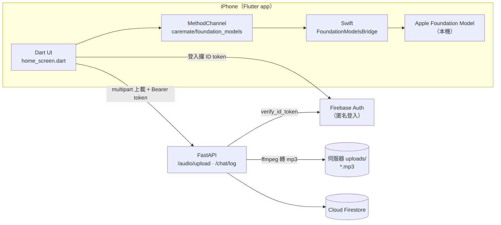

# CareMate 原型開發教學：Flutter + Swift Foundation Models + Firebase + FastAPI

## 完成後你會有

- [ ] Flutter app 喺 iPhone 上面同 **Apple Foundation Model** 傾偈（經 Swift MethodChannel）
- [ ] app 用 **Firebase 匿名登入**，每個用戶有自己嘅 uid
- [ ] **FastAPI 後端**驗證 Firebase token
- [ ] 手機**錄音或者揀現有 mp3**，上載去伺服器，伺服器統一轉成 **mp3** 存檔
- [ ] 上載記錄同 AI 對話記錄寫入 **Cloud Firestore**

## 架構



> **點解錄音唔直接錄 mp3？** iOS 嘅錄音 API（AVAudioRecorder）唔支援 mp3 編碼，所以 app 錄 m4a（AAC），上載後由伺服器用 ffmpeg 轉做 mp3。如果揀嘅檔案本身已經係 mp3，伺服器就直接存。
>
> **點解錄音唔放 Firebase Storage？** 而家 Cloud Storage for Firebase 要轉用 Blaze（按用量付費）計劃先用得（[Firebase](https://firebase.google.com/docs/storage/faqs-storage-changes-announced-sept-2024)）。原型階段將音檔放喺自己 FastAPI 伺服器，Firebase 只用免費嘅 Auth 同 Firestore 就夠。

## 檔案位置

```
files/
├── Dev/教學_Flutter_Swift_Firebase_FastAPI.md    ← 本文件
├── backend/                                       ← FastAPI（已測試可運行）
│   ├── app/
│   │   ├── main.py            入口
│   │   ├── config.py          讀 .env
│   │   ├── firebase.py        Firebase Admin 初始化
│   │   ├── deps.py            驗證 Firebase ID token
│   │   ├── routers/health.py  GET /health
│   │   ├── routers/audio.py   POST /audio/upload、GET /audio、GET /audio/{id}.mp3
│   │   ├── routers/chat.py    POST /chat/log
│   │   └── services/audio_convert.py   ffmpeg 轉 mp3
│   ├── firestore.rules        Firestore 安全規則
│   ├── requirements.txt
│   └── .env.example
└── mobile/caremate_app_overlay/                   ← 複製入 flutter create 出嚟嘅專案
    ├── pubspec_dependencies.yaml
    ├── lib/main.dart, config.dart
    ├── lib/services/ai_service.dart, api_service.dart, recorder_service.dart
    ├── lib/screens/home_screen.dart
    └── ios/Runner/AppDelegate.swift, FoundationModelsBridge.swift, Info.plist.additions.xml
```

---

## 第 0 步：準備環境

| 項目 | 要求 |
|---|---|
| Mac | Apple silicon，最新 macOS，**開咗 Apple Intelligence**（設定 → Apple Intelligence 與 Siri） |
| Xcode | Xcode 27（iOS 27 SDK） |
| Flutter | 3.41 或以上（而家 stable 係 3.47，[Flutter](https://docs.flutter.dev/release/whats-new)） |
| Python | 3.11 或以上 |
| ffmpeg | `brew install ffmpeg` |
| iPhone | iPhone 15 Pro 或之後，iOS 27，開咗 Apple Intelligence |

**模擬器都用得 Foundation Models**，但前提係你部 Mac 支援 Apple Intelligence 而且已經開咗（[Apple Developer Forums](https://developer.apple.com/forums/thread/787199)）。錄音同效能測試就一定要用真機。

如果 `availability` 一直唔係 `available`：試下將裝置語言設做 English、地區設做 United States，因為 Apple Intelligence 要支援你嘅系統語言同地區（[Apple Developer Forums](https://developer.apple.com/forums/thread/787445)）。

```bash
flutter doctor          # 確認 Xcode、CocoaPods 都 OK
brew install ffmpeg
```

---

## 第 1 步：建立 Firebase

### 1.1 開 project

1. 去 [Firebase Console](https://console.firebase.google.com/) → **建立專案**，名例如 `caremate-fyp`
2. Google Analytics 可以唔開
3. 計劃保持 **Spark（免費）** 就得

### 1.2 開 Authentication

**Build → Authentication → Get started → Sign-in method → Anonymous → Enable**

### 1.3 開 Firestore

1. **Build → Firestore Database → Create database**
2. 地區揀 `asia-east2`（香港）；**注意：地區揀咗之後改唔到**
3. 揀 **Production mode**
4. 去 **Rules** 分頁，貼上 `backend/firestore.rules` 嘅內容 → **Publish**

### 1.4 下載後端用嘅 Service Account Key

**Project settings（齒輪）→ Service accounts → Generate new private key**

- 下載落嚟嘅 JSON 改名做 `serviceAccountKey.json`，放入 `backend/` 資料夾
- **呢個檔案等同管理員密碼，千祈唔好 commit 上 Git 或者傳畀人**（`.gitignore` 已經排除咗）

---

## 第 2 步：建立 FastAPI 後端

### 2.1 安裝

```bash
cd backend
python3 -m venv .venv
source .venv/bin/activate
pip install -r requirements.txt

cp .env.example .env
# 用文字編輯器打開 .env，確認 FIREBASE_CREDENTIALS=./serviceAccountKey.json
```

### 2.2 啟動

```bash
uvicorn app.main:app --host 0.0.0.0 --port 8000 --reload
```

- `--host 0.0.0.0`：容許同一 Wi-Fi 嘅 iPhone 連入嚟
- `--reload`：改 code 自動重啟

打開 <http://localhost:8000/docs>，會見到 FastAPI 自動產生嘅 API 文件，可以直接喺網頁度試。

### 2.3 用 curl 測試（唔使手機）

暫時喺 `.env` 設 `DEV_SKIP_AUTH=1`（跳過 token 驗證），然後：

```bash
# 測試連線
curl http://localhost:8000/health
# → {"status":"ok","firebase":true,"dev_skip_auth":true}

# 整一個 3 秒測試音檔再上載
ffmpeg -f lavfi -i "sine=frequency=440:duration=3" -c:a aac test.m4a
curl -F "file=@test.m4a" -F "source=record" http://localhost:8000/audio/upload
# → {"id":"a6ea...","duration_sec":3.02,"mp3_path":"dev-user/a6ea....mp3","saved_to_firestore":true,...}

# 列出已上載
curl http://localhost:8000/audio
```

上載成功後：

- `backend/uploads/dev-user/` 會見到 `.mp3`
- Firebase Console → Firestore 會見到 `audio_uploads` collection

**測試完記得將 `DEV_SKIP_AUTH` 改返 `0`。**

### 2.4 API 一覽

| Method | Path | 用途 | 需要 token |
|---|---|---|---|
| GET | `/health` | 測試連線 | 否 |
| POST | `/audio/upload` | 上載音訊（form 欄位 `file`、`source`），自動轉 mp3 | 是 |
| GET | `/audio` | 列出自己嘅錄音 | 是 |
| GET | `/audio/{id}.mp3` | 下載自己嘅 mp3 | 是 |
| POST | `/chat/log` | 記錄 AI 對話（JSON：`user_text`、`ai_text`、`model_tier`、`fallback_reason`） | 是 |

### 2.5 等 iPhone 連到你部 Mac

**方法 A（建議）：cloudflared 臨時 https 網址**

```bash
brew install cloudflared
cloudflared tunnel --url http://localhost:8000
# 會顯示 https://xxxx-xxxx.trycloudflare.com
```

- 好處：係 https，iOS 唔使改任何安全設定，手機用 4G 都連到
- 每次重開網址都會變，要重新傳入 app

**方法 B：同一 Wi-Fi 直接用 IP**

1. Mac 查 IP：`ipconfig getifaddr en0`（例如 `192.168.1.23`）
2. app 用 `http://192.168.1.23:8000`
3. 要加 Info.plist 嘅開發例外（見 3.5）
4. 第一次連線時 iOS 會問「本地網絡」權限，要撳允許
5. 學校 Wi-Fi 通常封鎖裝置之間互連，**喺學校建議用方法 A**

---

## 第 3 步：建立 Flutter app

### 3.1 建立專案

```bash
flutter create --org hk.edu.ive.caremate --platforms ios,android caremate_app
cd caremate_app
```

### 3.2 加套件

```bash
flutter pub add firebase_core firebase_auth cloud_firestore record path_provider http file_picker
```

### 3.3 連接 Firebase（FlutterFire CLI）

```bash
npm install -g firebase-tools          # 如未安裝
firebase login
dart pub global activate flutterfire_cli
flutterfire configure --project=caremate-fyp
# 揀 ios 同 android；會自動產生 lib/firebase_options.dart
```

### 3.4 複製程式碼

將 `mobile/caremate_app_overlay/` 入面嘅檔案複製去 `caremate_app/` 對應位置：

```bash
OVERLAY=<路徑>/mobile/caremate_app_overlay
cp -R $OVERLAY/lib/* lib/
cp $OVERLAY/ios/Runner/AppDelegate.swift ios/Runner/AppDelegate.swift
cp $OVERLAY/ios/Runner/FoundationModelsBridge.swift ios/Runner/
```

**重要：`FoundationModelsBridge.swift` 一定要喺 Xcode 加入 target**，單單複製入資料夾係唔夠嘅：

1. `open ios/Runner.xcworkspace`
2. 左邊對住 **Runner** 資料夾撳右鍵 → **Add Files to "Runner"…** → 揀 `FoundationModelsBridge.swift` → 剔 **Target: Runner**

### 3.5 iOS 設定

**(a) 最低 iOS 版本**

Xcode → Runner target → **General → Minimum Deployments → iOS 26.0**。另外喺 `ios/Podfile` 頂部改成：

```ruby
platform :ios, '26.0'
```

Foundation Models 由 iOS 26 開始先有。程式碼有用 `#available` 檢查，但設 26.0 最簡單。

**(b) Info.plist**

將 `Info.plist.additions.xml` 入面嘅 key 加入 `ios/Runner/Info.plist`：

- `NSMicrophoneUsageDescription`：**必須加**，否則一錄音 app 就會 crash
- `NSAppTransportSecurity`、`NSLocalNetworkUsageDescription`：只係用方法 B（http + IP）先需要；用 cloudflared 可以唔加。上架前一定要刪走 `NSAllowsArbitraryLoads`

**(c) Signing**

Xcode → Runner → **Signing & Capabilities** → Team 揀你嘅 Apple ID。免費 Personal Team 都得，因為呢個原型冇用到 Push Notifications；但 app 7 日後會過期，要重新 build。

### 3.6 AppDelegate 點解咁寫

由 Flutter 3.41 開始，iOS app 預設用 `UIScene` lifecycle；用 Xcode 27 build 而冇採用 UIScene 嘅 app 會一開就 crash（[Flutter](https://docs.flutter.dev/release/breaking-changes/uiscenedelegate)）。所以 MethodChannel 要喺 `FlutterImplicitEngineDelegate` 嘅 `didInitializeImplicitFlutterEngine` 入面，用 `engineBridge.applicationRegistrar.messenger()` 註冊（[Flutter Platform Channels](https://docs.flutter.dev/platform-integration/platform-channels)）。網上舊教學用 `window?.rootViewController` 嘅寫法已經唔適用。

```swift
@main
@objc class AppDelegate: FlutterAppDelegate, FlutterImplicitEngineDelegate {
  private let fmBridge = FoundationModelsBridge()

  func didInitializeImplicitFlutterEngine(_ engineBridge: FlutterImplicitEngineBridge) {
    GeneratedPluginRegistrant.register(with: engineBridge.pluginRegistry)
    let channel = FlutterMethodChannel(
      name: "caremate/foundation_models",
      binaryMessenger: engineBridge.applicationRegistrar.messenger())
    channel.setMethodCallHandler { [weak self] call, result in
      self?.fmBridge.handle(call, result: result)
    }
  }
}
```

### 3.7 執行

```bash
# 用 cloudflared 網址
flutter run --dart-define=API_BASE_URL=https://xxxx-xxxx.trycloudflare.com

# 或者用同一 Wi-Fi 嘅 IP
flutter run --dart-define=API_BASE_URL=http://192.168.1.23:8000
```

---

## 第 4 步：Foundation Models 橋樑點運作

### 4.1 Dart ↔ Swift 溝通

| Dart 呼叫 | Swift 做咩 | 回傳 |
|---|---|---|
| `availability` | 讀 `SystemLanguageModel.default.availability` | `available` / `deviceNotEligible` / `appleIntelligenceNotEnabled` / `modelNotReady` |
| `respond` `{prompt, instructions}` | 用同一個 `LanguageModelSession` 回覆（記得之前講過咩） | `{text, tier: 1}`，或者 `PlatformException` |
| `reset` | 清空 session（開新話題） | `null` |

三個「唔可以用」嘅原因分別係：裝置唔支援 Apple Intelligence、Apple Intelligence 未開、模型未下載好（[Apple](https://developer.apple.com/documentation/foundationmodels/systemlanguagemodel/availability-swift.enum/unavailablereason/modelnotready)）。模型會根據網絡、電量同系統負載自動下載。

### 4.2 錯誤碼（之後用嚟觸發 Tier 2 fallback）

| 錯誤碼 | 意思 | 而家點處理 | 之後 |
|---|---|---|---|
| `UNAVAILABLE` | 模型用唔到 | 顯示預設回覆 | 轉自訓模型 |
| `GUARDRAIL` | Apple 安全機制拒答 | 顯示預設回覆 | 轉自訓模型 + 規則層風險檢查 |
| `CONTEXT_FULL` | 對話太長 | 自動開新 session | 先摘要再開新 session |
| `GENERATION_ERROR` / `UNKNOWN` | 其他錯誤 | 顯示預設回覆 | 記錄 log |

Dart 端（`ai_service.dart`）已經 catch 晒呢啲錯誤，回傳 `tier: 0` 同 `fallbackReason`，然後 `/chat/log` 會將佢寫入 Firestore，方便你之後統計 fallback 比例。

### 4.3 Android 點算

Android 冇呢個 channel，`AiService` 會 catch `MissingPluginException`，顯示「未支援」。呢個係預期行為：照顧者 Android app 只負責睇資料，唔使用 AI。

---

## 第 5 步：端對端測試清單

| # | 測試 | 預期結果 | 寫入 Test Plan |
|---|---|---|---|
| 1 | 開 app | 「AI 狀態：available」 | TC-AI-01 |
| 2 | 撳「測試伺服器連線」 | 顯示 `status: ok, firebase: true` | TC-API-01 |
| 3 | 輸入「今日好悶呀」→ 傳送 | 1–3 句廣東話回覆 | TC-AI-02 |
| 4 | 再問「我頭先講咗咩？」 | 記得上一句（多輪對話） | TC-AI-03 |
| 5 | Firestore `users/{uid}/messages` | 有對話記錄，`model_tier: 1` | TC-DB-01 |
| 6 | 撳「開始錄音」→ 講 5 秒 → 停止 | 「成功！長度：5.x 秒」 | TC-AUD-01 |
| 7 | 檢查 `backend/uploads/{uid}/` | 有 `.mp3` 檔，播放到 | TC-AUD-02 |
| 8 | Firestore `audio_uploads` | 有記錄，`uid` 同 app 一致 | TC-DB-02 |
| 9 | 揀一個現有 mp3 上載 | 成功，`source: file` | TC-AUD-03 |
| 10 | 關咗後端再上載 | 顯示「失敗」，app 冇 crash | TC-ERR-01 |
| 11 | 用 curl 唔帶 token 上載（`DEV_SKIP_AUTH=0`） | `401` | TC-SEC-01 |
| 12 | 上載 `.txt` 檔 | `400 唔支援嘅格式` | TC-ERR-02 |

---

## 常見錯誤

| 錯誤 | 原因 | 解決 |
|---|---|---|
| App 一開就 crash（Xcode 27） | 未採用 UIScene | 用本教學嘅 `AppDelegate.swift`；Flutter 升級到 3.41 或以上 |
| `MissingPluginException`（iOS） | Swift 檔未加入 target，或者 channel 名唔一致 | 3.4 嘅「Add Files to Runner」；兩邊都要係 `caremate/foundation_models` |
| `Cannot find 'FoundationModelsBridge' in scope` | 同上 | 同上 |
| AI 狀態 `appleIntelligenceNotEnabled` | 設定未開 | iPhone 設定 → Apple Intelligence 與 Siri → 開啟 |
| AI 狀態 `modelNotReady` | 模型下載緊 | 接 Wi-Fi、叉電，等一陣 |
| 錄音即 crash | 冇 `NSMicrophoneUsageDescription` | 加入 Info.plist |
| 上載 `SocketException` / timeout | 手機連唔到 Mac | 用 cloudflared；或者確認同一 Wi-Fi、`--host 0.0.0.0`、Mac 防火牆 |
| 上載 `401` | token 問題 | 確認 app 已經匿名登入；後端 `serviceAccountKey.json` 同 app 係同一個 Firebase project |
| 上載 `503 伺服器未設定 Firebase` | 後端搵唔到 key | 檢查 `.env` 嘅 `FIREBASE_CREDENTIALS` 路徑 |
| 上載 `422 轉換 mp3 失敗` | 未裝 ffmpeg | `brew install ffmpeg` |
| `pod install` 失敗 | iOS 版本設定太低 | Podfile 設 `platform :ios, '26.0'`，再 `cd ios && pod install --repo-update` |

---

## 下一步建議

1. **語音轉文字（STT）**：後端收到 mp3 之後做語音辨識，將 `audio_uploads.status` 改成 `transcribed`，再將文字交畀 AI 回覆
2. **語音播放（TTS）**：用 iOS `AVSpeechSynthesizer` 讀出 AI 回覆，選 Cantonese (Hong Kong) 聲音
3. **食藥提醒**：Firestore 加 `medication_schedules`、`dose_events`；後端加 APScheduler job
4. **AI Router**：喺 `ai_service.dart` 嘅 `PlatformException` 分支，加入 Tier 2（自訓模型）
5. **Apple Watch**：新增 watchOS target，用 WatchConnectivity 同 iPhone 溝通
