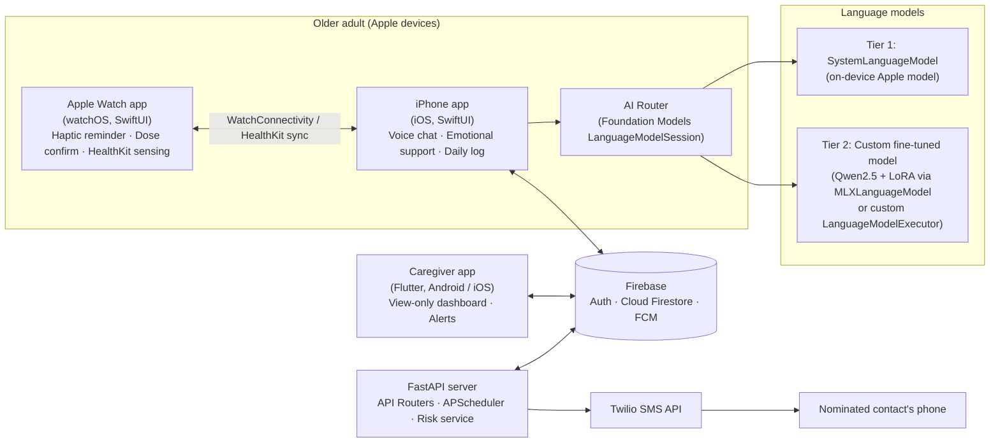

# Project Proposal

**Hong Kong Institute of Vocational Education — Discipline of Information Technology**
**ITE4116M Final Year Project – Systems Development and Administration**

| Item | Details |
|---|---|
| Project title | CareMate: An AI-Assisted Companion, Emotional Support and Medication Reminder System for Older Adults |
| Group number | [Group No.] |
| Members | [Member A] · [Member B] · [Member C] · [Member D] |
| Supervisor | [Supervisor Name] |
| Date of submission | [DD/MM/2026] |

---

## 1. Statement of Problem to Be Solved

Many older adults in Hong Kong live alone or spend long hours without company. They face three connected problems that current tools do not solve together:

1. **Loneliness and unrecognised emotional distress.** Low mood, anxiety and early signs of depression are often not noticed by family members until they become serious.
2. **Missed or forgotten medication.** Older adults often take several medicines at different times, and a missed dose is usually not known to anyone.
3. **Health changes that are recorded but not acted on.** Smart watches already collect heart rate and other vital signs, but the data is rarely turned into timely, caring action.

The proposed system, **CareMate**, provides the following services:

- **Companion chat by voice.** The older adult talks to CareMate in Cantonese or English. Speech is converted to text, answered by an AI model, and read aloud.
- **Emotional support.** CareMate uses supportive conversation techniques, keeps track of mood, and assesses a **risk level** for each conversation.
- **Medication reminders.** Reminders are delivered as Apple Watch haptic alerts and iPhone notifications. The user confirms a dose with one large button.
- **Proactive conversation.** When Apple Watch data (e.g. heart rate, respiratory rate) is outside the user's normal range, CareMate starts a gentle check-in conversation.
- **Automatic escalation.** An SMS is sent to the nominated contact through Twilio when (a) a high emotional risk level is detected, or (b) a dose remains unconfirmed after a grace period.
- **Daily log.** An automatically generated daily summary of mood, medication adherence and vital-sign trends.
- **Caregiver viewer.** Family members or social workers can view the data and alerts on an **Android** phone (and on iOS).

## 2. Background of the Problem

### 2.1 Social context

Hong Kong is a super-aged society. Residents aged 65 and over made up about 23% of the population in 2024, up from 15% in 2015 ([Our Hong Kong Foundation](https://ourhkfoundation.org.hk/s3/s3fs-public/2025-04/%5BENG%5D%20Senior%20Living_Research%20Deck.pdf)). The Census and Statistics Department projects that this share will reach 36.0% by 2046 ([C&SD Population Projections 2022–2046](https://www.censtatd.gov.hk/en/data/stat_report/product/FA100061/att/B72310FA2023XXXXB0100.pdf)). The number of older people living alone rose from 173,100 in 2020 to 247,700, an increase of about 43% in five years ([CNA](https://www.channelnewsasia.com/east-asia/hong-kong-growing-elderly-population-living-alone-better-support-urged-5954596)).

Depression is one of the most common psychiatric disorders in older people. One study reports a prevalence of 13.7% for older women and 8.9% for older men in Hong Kong ([PMC](https://pmc.ncbi.nlm.nih.gov/articles/PMC7663870/)). Medication non-adherence in older adults is common and is driven by memory problems, polypharmacy, physical difficulties and gaps in social support ([PMC](https://pmc.ncbi.nlm.nih.gov/articles/PMC12568856/)).

### 2.2 Operating environment

- **Primary users:** older adults (aged 65+) living at home, often alone, who own an Apple Intelligence-compatible iPhone and an Apple Watch.
- **Secondary users:** family members, domestic helpers or social workers who monitor the older adult remotely, often using Android phones.
- **Setting:** home use in Hong Kong. The interface is bilingual (Traditional Chinese / English) with a Cantonese voice. This supports the programme's aim of bilingual, Greater China-deployable systems.

### 2.3 Technology context

Apple's Foundation Models framework gives apps direct access to an on-device large language model. From iOS 27, the framework also provides a `LanguageModel` protocol, so Apple's on-device model, Apple's Private Cloud Compute (PCC) model and third-party or open-source models can all be used through the same `LanguageModelSession` API ([Apple WWDC26](https://developer.apple.com/videos/play/wwdc2026/241/)). This makes a **tiered, privacy-first AI design** possible: the Apple model is tried first, and the team's own fine-tuned model is used when the Apple model cannot handle a request.

## 3. Outline of Proposed Solution

### 3.1 System architecture

CareMate follows a **multi-tier client–server architecture** with native Apple clients, a cross-platform caregiver client, a cloud database and an application server.

**Figure 1. CareMate system architecture (initial)**

| Tier | Component | Technology |
|---|---|---|
| Presentation (elder) | iPhone app, Apple Watch app | Swift, SwiftUI, WatchKit, HealthKit, Speech, AVFoundation |
| Presentation (caregiver) | View-only dashboard | Flutter (Dart), Android primary target |
| AI | AI Router + model tiers | Apple Foundation Models framework, MLX Swift, LoRA fine-tuning |
| Application | REST API, scheduler, escalation | Python, FastAPI (`APIRouter`), APScheduler, Twilio SDK |
| Data | Authentication, database, push notifications | Firebase Authentication, Cloud Firestore, Firebase Cloud Messaging |

### 3.2 AI approach: tiered model routing (Solution 1)

The AI Router is the core algorithm of the project. Every user utterance goes through the following steps:

1. **Safety pre-check (rule-based, no LLM).** The utterance is matched against a crisis keyword list (self-harm, suicide, severe distress) and checked for recent vital-sign anomalies. A match skips the model and triggers crisis handling immediately (Section 3.4). This is deliberate: the Apple model's safety guardrails may refuse sensitive topics, so crisis handling must never depend on an LLM answering.
2. **Tier 1 – Apple on-device model (`SystemLanguageModel`).** This model handles daily chat, reminders, daily-log summarisation and structured mood/risk classification using guided generation (`@Generable` Swift types). On-device processing keeps conversations private and works without an internet connection. Its context window is 8,192 tokens ([Apple WWDC26](https://developer.apple.com/videos/play/wwdc2026/241/)).
3. **Fallback triggers.** The router switches to Tier 2 when any of these happens:
   - the model is unavailable (unsupported device, Apple Intelligence disabled, or model assets not ready);
   - a guardrail-violation error is returned;
   - the context window is exceeded;
   - the Tier-1 classifier labels the topic as *emotional-support-specialised* or the risk level as *medium* or higher.
4. **Tier 2 – team fine-tuned model.** Qwen2.5-Instruct is fine-tuned with LoRA/QLoRA on emotional-support and elderly-care dialogue. It is then converted to MLX format and run through `MLXLanguageModel`, or served from a Mac host through a custom `LanguageModelExecutor` ([Apple Developer](https://developer.apple.com/documentation/updates/foundationmodels.md); [WWDC26 Session 339](https://developer.apple.com/videos/play/wwdc2026/339/)). The session code does not change between tiers; only the model object is swapped.
5. **Post-check.** Every reply is checked against output rules (no diagnosis, no dosage advice). The session outcome is then logged to Firestore.

> **Alternative considered and rejected (Solution 2: fine-tuning the Apple model directly).** Apple's Foundation Models adapter toolkit trains LoRA adapters for the system model. However, version 26.0.0 is the last release and is not compatible with iOS/macOS 27 or later. Each adapter works with only one system model version, and deploying an adapter requires a special entitlement ([Apple Developer](https://developer.apple.com/apple-intelligence/foundation-models-adapter/)). Because target devices now run iOS 27, this approach is not sustainable, so Solution 1 is adopted.

### 3.3 Model training plan

| Aspect | Plan |
|---|---|
| Base model | Qwen2.5-Instruct (3B for on-device MLX; 7B for Mac-hosted, if hardware allows). Llama-3.2-3B-Instruct will be used as a comparison baseline. |
| Method | Parameter-efficient fine-tuning (LoRA / QLoRA). Base weights stay frozen and only adapter weights are trained. |
| Training data | Public Chinese/English emotional-support dialogue corpora (licences checked before use), plus a team-authored Cantonese elderly-care dialogue set of about 300–500 samples, reviewed for safety. |
| Evaluation data | ElderBench ([GitHub](https://github.com/AmEskandari/ElderBench)), a benchmark of older adults' needs, for response quality. MECO ([MECO](https://maitrechen.github.io/meco-page/)) as a reference for emotion categories if data access is approved. |
| Metrics | Human-rated empathy / helpfulness / safety (1–5 scale), crisis-detection recall, latency, and the proportion of requests handled by Tier 1 vs Tier 2. |

### 3.4 Other key algorithms

**(a) Risk-level assessment.** The final risk level is the maximum of two independent scores:

- a **rule score** from crisis keywords, sustained negative mood (for example, three consecutive days rated "low"), and vital-sign anomalies;
- a **model score**: a structured `RiskAssessment { level: low | medium | high, reason }` produced by guided generation.

A *high* result calls the FastAPI `/alerts/risk` endpoint. The server sends an SMS to the nominated contact through Twilio and displays hotline information (for example, The Samaritan Befrienders Hong Kong) to the user.

**(b) Missed-dose detection.** An APScheduler interval job on the FastAPI server runs every 5 minutes and checks Firestore for `dose_events` where `status = pending` and `now > scheduled_time + grace_period`:

- Stage 1 (grace period, e.g. 15 min, passed): the reminder is sent again with a watch haptic through FCM.
- Stage 2 (e.g. 30 min passed): the event is marked `missed`, and a Twilio SMS and an app alert are sent to the caregiver.

A persistent job store is used so that schedules survive a server restart.

**(c) Vital-sign anomaly detection for proactive conversation.** For each user, a rolling baseline (mean ± k·SD over the past 14 days) of resting heart rate and respiratory rate is calculated from HealthKit samples. Readings outside the band during rest periods trigger a gentle check-in conversation. Watch data synchronises with some delay, so this feature is designed for **wellbeing check-ins, not emergency detection**.

### 3.5 Development methodology

The project uses an **object-oriented approach** with UML for analysis and design (use case, class, 3-tier sequence and state diagrams), following an **iterative and incremental process model**:

- Iteration 1: core infrastructure and reminders.
- Iteration 2: voice chat and the AI Router.
- Iteration 3: risk assessment, escalation and the caregiver viewer.
- Iteration 4: fine-tuned model, evaluation and refinement.

Each iteration ends with a demo to the supervisor. This lowers the risk of the new Apple APIs and gives the interim report a working prototype.

Work is divided using **data interfaces** (a shared Firestore schema) and **programming interfaces** (an agreed FastAPI REST contract and the Swift `LanguageModel` protocol), as recommended in the project guide.

### 3.6 Scope of the proposed system

#### 3.6.1 Functional requirements

| ID | Function | Client |
|---|---|---|
| F1 | Register / log in; link an older adult with one or more caregivers | iPhone, Caregiver |
| F2 | Accessibility settings: large font (Dynamic Type), high contrast, speech rate, language | iPhone, Watch |
| F3 | Voice input (speech-to-text) and voice output (text-to-speech, Cantonese / English) | iPhone |
| F4 | Companion chat through the AI Router (Tier 1 / Tier 2) | iPhone |
| F5 | Emotional support conversation with mood tracking and risk assessment | iPhone |
| F6 | Crisis handling: hotline display and automatic Twilio SMS to contacts | iPhone, Server |
| F7 | Medication schedule management (set up by the caregiver or the older adult) | Caregiver, iPhone |
| F8 | Medication reminder with Apple Watch haptic and one-tap confirmation | Watch, iPhone |
| F9 | Missed-dose detection and escalation (APScheduler + Twilio) | Server |
| F10 | Collect HealthKit data (heart rate, respiratory rate, steps, sleep) and sync to Firestore | Watch, iPhone |
| F11 | Proactive check-in conversation triggered by vital-sign anomalies | iPhone |
| F12 | Daily log generation (mood, adherence, vital trends, conversation highlights) | iPhone |
| F13 | Caregiver dashboard: view vitals, adherence, daily logs and alert history (read-only) | Caregiver (Android) |
| F14 | Emergency contact management | iPhone, Caregiver |

#### 3.6.2 Data handled by the system

| Firestore collection | Main fields |
|---|---|
| `users` | uid, role (elder / caregiver), name, language, accessibility settings |
| `care_links` | elder_uid, caregiver_uid, relationship, permissions |
| `emergency_contacts` | elder_uid, name, phone (E.164), priority |
| `medications` | med_id, elder_uid, name, dosage text (as prescribed), instructions |
| `medication_schedules` | schedule_id, med_id, times of day, days of week, grace_period |
| `dose_events` | event_id, schedule_id, scheduled_time, status (pending / taken / missed), confirmed_at, source (watch / phone) |
| `health_samples` | elder_uid, type (hr / rr / steps / sleep), value, unit, start / end time |
| `mood_records` | elder_uid, timestamp, mood label, score, risk level, model tier used |
| `alerts` | alert_id, elder_uid, type (risk / missed_dose), level, sent_to, Twilio SID, timestamp |
| `daily_logs` | elder_uid, date, summary text, adherence %, mood trend, vital summary |

Full conversation transcripts are kept **on the device only**. Only summaries and classifications are uploaded, to reduce the amount of personal data stored in the cloud.

#### 3.6.3 Non-functional requirements

| Category | Requirement |
|---|---|
| Usability | Elder-friendly UI: minimum 20pt body text with Dynamic Type support, high-contrast colour scheme, touch targets larger than Apple's 44 × 44 pt minimum, at most 3 main actions per screen, voice-first interaction. |
| Performance | Target first spoken response within about 3 seconds for Tier 1; reminder haptic delivered within 1 minute of the scheduled time; escalation SMS sent within 1 minute of detection. |
| Reliability | Reminders are scheduled locally on the device as a backup in case of network loss; the server job store persists across restarts; if AI tiers fail, the app falls back to a safe, pre-written response. |
| Privacy & security | Firebase Authentication; Firestore security rules restricting access by `care_links`; HTTPS/TLS; minimal data collection; explicit consent screen; compliance with the Personal Data (Privacy) Ordinance and Apple HealthKit data-use rules. |
| Safety & ethics | Clear disclaimer that CareMate is not a medical or counselling professional; no diagnosis or dosage advice; human escalation for high-risk cases. |
| Platform | iOS 27+ on an Apple Intelligence-compatible iPhone (iPhone 15 Pro or later); watchOS on Apple Watch Series 9 / Ultra 2 or later ([Apple Support](https://support.apple.com/en-us/121115)); caregiver app on Android 10+ and iOS. |
| Interfaces with existing systems | Apple HealthKit, Apple Foundation Models, Firebase, Twilio SMS API. |
| Language | Traditional Chinese and English UI; Cantonese and English voice. |
| Environmental friendliness | Preferring on-device inference reduces cloud compute and network traffic; the same app replaces paper medication charts. |

#### 3.6.4 Out of scope

Medical diagnosis, automatic emergency-service (999) dialling, fall detection, and integration with hospital systems (e.g. eHealth) are outside the scope of this project. They are listed as possible future extensions.

## 4. Explanation of Why the Proposed Solution Is Appropriate

1. **It matches the users' abilities.** Voice-first interaction, large text and one-tap confirmation remove the need to type or navigate complex menus. Haptic reminders on the wrist are noticed even when the phone is in another room.
2. **Privacy comes first by design.** Most conversations are processed by the Apple on-device model, so sensitive emotional content does not need to leave the phone. This is important for mental-health data.
3. **The tiered AI design is reliable.** The Foundation Models `LanguageModel` protocol lets the team combine Apple's efficient on-device model with a custom model trained for emotional support. Each model handles the requests it is best at, and there is no dependency on a deprecated toolkit.
4. **Safety does not depend on AI.** Crisis detection and missed-dose escalation are rule-based and server-scheduled, so they still work if a model refuses, fails or is unavailable.
5. **It connects the family.** A view-only Android dashboard reflects the real Hong Kong situation, where the older adult and their family often use different platforms.
6. **It answers the Driving Question.** The project applies software engineering techniques (requirements analysis, OO/UML design, iterative development, testing and evaluation with a benchmark) to build a system that supports the everyday activities of older adults and their caregivers.

## 5. Main Stages (Project Plan)

Academic year 2026/27. The dates below are provisional and will be refined in the Initial Report.

| Stage | Main tasks | Period | Milestone / deadline |
|---|---|---|---|
| 0. Project start-up | Form group, confirm supervisor, project suggestion | Sep 2026 | Group list & suggestion (Sep) |
| 1. Proposal & feasibility | Literature review, technology spikes (Foundation Models, HealthKit, Cantonese speech, Twilio), proposal | Sep – early Oct 2026 | **Project Proposal (Sep/Oct 2026)** |
| 2. Requirements analysis | Stakeholder interviews (older adults, caregivers, social workers), use cases, actor descriptions, data dictionary | Oct 2026 | Requirements baseline |
| 3. Initial design | Architecture, Firestore schema, REST API contract, UI wireframes, test strategy | Oct – Nov 2026 | **Initial Report (Nov 2026)** — draft 1 week before |
| 4. Iteration 1 | Firebase setup, auth, medication schedule, watch reminder + confirm, APScheduler + Twilio escalation | Nov – Dec 2026 | Prototype v0.1 |
| 5. Iteration 2 | Voice I/O, AI Router with Tier 1, mood/risk classification, dataset preparation and first LoRA training run | Dec 2026 – Jan 2027 | Prototype v0.2 |
| 6. Interim assessment | UML documentation (class, 3-tier sequence, state diagrams), UI design, critical evaluation, presentation | Jan – Feb 2027 | **Interim Report + Presentation & Demo (Jan/Feb 2027)** |
| 7. Iteration 3 | Tier 2 integration, HealthKit anomaly detection, proactive conversation, daily log, caregiver Flutter app | Feb – Mar 2027 | Progress report & mid-semester demo |
| 8. Iteration 4 | Model evaluation (ElderBench, human ratings), usability testing with older adults, bug fixing, performance tuning | Mar – Apr 2027 | Release candidate |
| 9. Final assessment | Final report, user guide, installation guide, presentation, demo recording | Apr – May 2027 | **Final Report + Presentation & Demo (Apr/May 2027)** — draft 2 weeks before |

The group meets the supervisor for 30 minutes every week and submits a log-sheet every two weeks, as required by the project guide.

## 6. Main Deliverables

1. **Software**
   - CareMate iPhone app (iOS, Swift/SwiftUI)
   - CareMate Apple Watch app (watchOS)
   - CareMate Caregiver app (Flutter, Android APK and iOS build)
   - FastAPI application server with scheduler and Twilio integration
   - Firebase project configuration (Firestore schema, security rules)
   - Fine-tuned Tier-2 model (LoRA adapter + MLX-converted weights), training scripts and evaluation scripts
2. **Documentation**
   - Project Proposal, Initial Report, Interim Report, Final Report
   - UML models: use case, class, sequence, state diagrams; data dictionary
   - Test plan and test results, including the AI evaluation report
   - User Guide and Installation Guide (separate volume)
   - Project logbook (bi-weekly log-sheets)
3. **Presentation materials:** interim and final presentation slides, and a recorded demo of the secondary functions.
4. **Source code and executables** on CD/DVD (or a repository archive), as required.

## 7. Responsibilities of Each Member

Each member owns one subsystem and is individually assessable. All members contribute to the reports, testing and presentations.

| Member | Subsystem | Main responsibilities | Interfaces owned |
|---|---|---|---|
| [Member A] — iOS Lead | Elder iPhone app | SwiftUI UI/UX for accessibility, voice input/output (Speech, AVSpeechSynthesizer), chat UI, daily log UI, AI Router integration, usability testing with older adults | Consumes the AI Router API and the Firestore schema |
| [Member B] — AI Lead | AI Router & custom model | Foundation Models integration (Tier 1, guided generation for mood/risk), fallback logic, dataset preparation, LoRA fine-tuning of Qwen2.5, MLX conversion (Tier 2), AI evaluation with ElderBench | Owns the `LanguageModel` integration and the `RiskAssessment` schema |
| [Member C] — Wearable & Health Lead | Apple Watch app & health data | watchOS app, haptic reminders, dose confirmation, WatchConnectivity, HealthKit collection and background sync, vital-sign baseline and anomaly detection | Owns the `health_samples` and `dose_events` data |
| [Member D] — Backend & Caregiver Lead | Server, database & caregiver app | Firebase design and security rules, FastAPI routers, APScheduler missed-dose job, Twilio escalation, FCM push, Flutter caregiver dashboard (Android) | Owns the REST API contract and the Firestore schema |

For a 3-member group, Member C's tasks are shared between Members A (watch app) and D (health-data sync).

## 8. Risks and Mitigation

| Risk | Impact | Mitigation |
|---|---|---|
| Apple Intelligence unavailable or disabled on a device | Tier 1 unavailable | The router detects availability and falls back to Tier 2 or to pre-written responses |
| Cantonese speech recognition accuracy is not good enough | Poor voice experience | Early technology test with real older adults' speech; a cloud STT service as contingency; on-screen large-button input as backup |
| Watch health data is delayed (not real time) | Proactive chat triggered late | Position the feature as a wellbeing check-in, not emergency detection; document it as a known limitation |
| GPU / Mac memory not enough for fine-tuning a 7B model | Tier 2 delayed | Use QLoRA on a 3B model first; use cloud GPU credits if needed |
| Twilio trial restrictions (verified numbers only) | Demo SMS failure | Verify demo numbers in advance; FCM push as secondary alert channel |
| Need for Apple developer entitlements and real devices | Blocked testing | Join the Apple Developer Program early; borrow supported devices from the department |
| Ethical risk of AI emotional support | Harm to user | Rule-based crisis path, human escalation, disclaimers, supervisor review of the conversation design |

## 9. References

1. APPLE INC. (2026). *What's new in the Foundation Models framework* (WWDC26 Session 241). Cupertino: Apple. https://developer.apple.com/videos/play/wwdc2026/241/
2. APPLE INC. (2026). *Bring an LLM provider to the Foundation Models framework* (WWDC26 Session 339). Cupertino: Apple. https://developer.apple.com/videos/play/wwdc2026/339/
3. APPLE INC. (2026). *Foundation Models adapter training*. Cupertino: Apple. https://developer.apple.com/apple-intelligence/foundation-models-adapter/
4. APPLE INC. (2026). *Foundation Models framework updates*. Cupertino: Apple. https://developer.apple.com/documentation/updates/foundationmodels.md
5. APPLE INC. (2026). *How to get the next generation of Apple Intelligence*. Cupertino: Apple. https://support.apple.com/en-us/121115
6. CENSUS AND STATISTICS DEPARTMENT (2023). *Hong Kong Population Projections for 2022 to 2046*. Hong Kong: HKSAR Government. https://www.censtatd.gov.hk/en/data/stat_report/product/FA100061/att/B72310FA2023XXXXB0100.pdf
7. CNA (2026). *Better support urged for Hong Kong's growing elderly population as more live alone*. Singapore: Mediacorp. https://www.channelnewsasia.com/east-asia/hong-kong-growing-elderly-population-living-alone-better-support-urged-5954596
8. ESKANDARI, A. M. et al. (2026). *ElderBench* [Dataset and benchmark]. GitHub. https://github.com/AmEskandari/ElderBench
9. MECO PROJECT TEAM (2026). *MECO: A Multimodal Dataset for Emotion and Cognitive Understanding in Older Adults*. https://maitrechen.github.io/meco-page/
10. OUR HONG KONG FOUNDATION (2025). *Senior Living Research Deck*. Hong Kong: OHKF. https://ourhkfoundation.org.hk/s3/s3fs-public/2025-04/%5BENG%5D%20Senior%20Living_Research%20Deck.pdf
11. *Medication Non-adherence in Older Adults* (2025). PubMed Central. https://pmc.ncbi.nlm.nih.gov/articles/PMC12568856/
12. *Neighbourhood environment and depressive symptoms among older adults* (2020). PubMed Central. https://pmc.ncbi.nlm.nih.gov/articles/PMC7663870/
13. TWILIO INC. (2026). *Twilio trial accounts*. San Francisco: Twilio. https://www.twilio.com/docs/usage/trials
